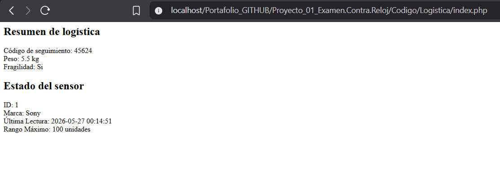
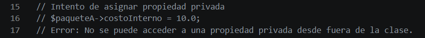
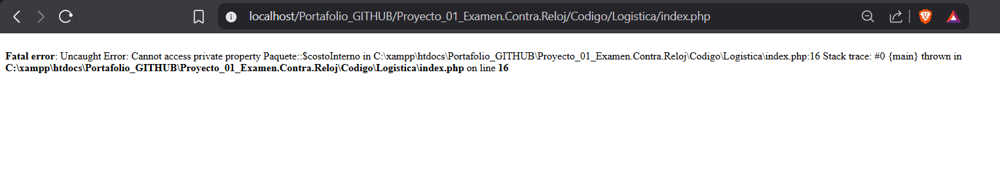

# Proyecto 01: Examen contra reloj

## 1. Nombre del proyecto
Examen práctico contra reloj - Corte 1

## 2. Objetivo del proyecto
Medir la precisión técnica en la sintaxis de PHP y la capacidad de modelado de datos mediante la definición de propiedades con tipado estricto, prescindiendo por completo del uso de comportamientos o métodos en las clases operativas.

## 3. Problema que resuelve
El proyecto aborda la necesidad de definir plantillas o moldes de datos consistentes y fuertemente tipados para dos escenarios del mundo real: la gestión de paquetería para la empresa FastDelivery y el monitoreo de variables físicas mediante sensores de plantas. Al restringir el uso de métodos, se resuelve la problemática de la transferencia y estructuración pura de atributos, forzando la validación de tipos nativos en el motor de PHP y exponiendo de manera didáctica los límites del acceso a datos protegidos.

## 4. Tecnologías utilizadas
* Lenguaje de programación backend: PHP 8.x (con soporte para tipado estricto)
* Diseño de interfaz de usuario: HTML5, CSS3 y Bootstrap 5.3
* Entorno de servidor local: XAMPP (Apache)

## 5. Conceptos aplicados
De acuerdo con los requerimientos técnicos fijados para la evaluación, se implementaron los siguientes conceptos:
* **Modelado de Datos Puro:** Creación de estructuras basadas exclusivamente en atributos, limitando la lógica interna para evaluar la asignación directa de tipos.
* **Tipado Estricto y Clases Predefinidas:** Asignación explícita de tipos nativos (`string`, `float`, `int`, `boolean`) y el uso de la clase global `DateTime` de PHP para la gestión de marcas de tiempo en el sensor.
* **Encapsulamiento y Visibilidad:** Configuración de la propiedad privada `$costoInterno` en la clase Paquete. Se forzó un intento de asignación externa en el archivo de prueba para comprobar el bloqueo en tiempo de ejecución del intérprete de PHP ante la violación de accesos restringidos.

## 6. Capturas de pantalla

### Ejecución y resultados óptimos
Procesamiento de los parámetros logísticos correctos y renderizado exitoso de los resultados operativos en la interfaz:

### Formulario de entrada y control de excepciones
A continuación se muestra el segmento del script principal donde se evidencia el intento de asignación directa al atributo privado `$costoInterno` y la correspondiente línea comentada que explica la restricción de visibilidad del paradigma:

### Validación y error de propiedad
Comportamiento y respuesta del sistema de control ante un error de ejecución provocado al intentar acceder o modificar directamente la propiedad privada `$costoInterno` desde fuera de la clase, demostrando la efectividad de las restricciones de visibilidad:

## 7. Instrucciones de ejecución
1. Clonar o descargar la carpeta de este proyecto (`Proyecto_01_Examen.Contra.Reloj`) dentro del directorio del servidor local `C:\xampp\htdocs\`.
2. Iniciar los servicios del servidor web Apache desde el Panel de Control de XAMPP.
3. Abrir el navegador web de su preferencia de manera local.
4. Ingresar a la siguiente dirección en la barra de navegación: `http://localhost/Proyecto_01_Examen.Contra.Reloj/Codigo/index.php`.

## 8. Reflexión personal

### ¿Qué aprendí?
Se consolidó la sintaxis de tipado estricto en las versiones modernas de PHP y se asimiló la diferencia práctica entre una clase diseñada para transportar datos (DTO) y una diseñada para procesar lógica. Asimismo, se comprobó cómo reacciona el servidor al intentar corromper las reglas de visibilidad al acceder a un atributo de tipo `private`.

### ¿Qué fue difícil?
El principal desafío radicó en asegurar la correcta distribución física de los archivos independientes (`src/Logistica/Paquete.php` y `Sensor.php`) junto con la correcta instanciación de objetos complejos como `DateTime` en el script principal, cuidando rigurosamente que las rutas de inclusión no generaran errores de carga en el servidor.

### ¿Qué mejoraría?
En un entorno de producción real, el modelado de datos sin métodos de validación puede permitir el ingreso de valores incoherentes (como pesos negativos). Para optimizarlo, integraría métodos mutadores (setters) con lógica de negocio o constructores con validación integrada una vez permitida la adición de funciones a las clases.
