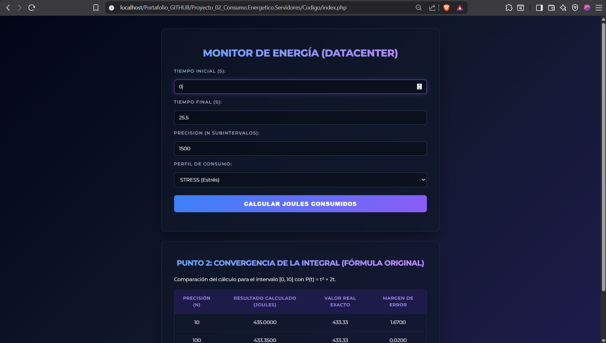
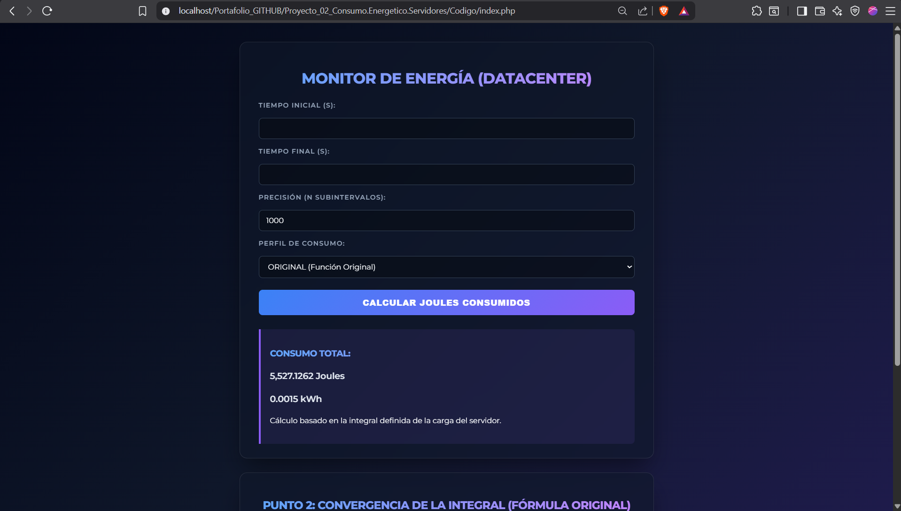
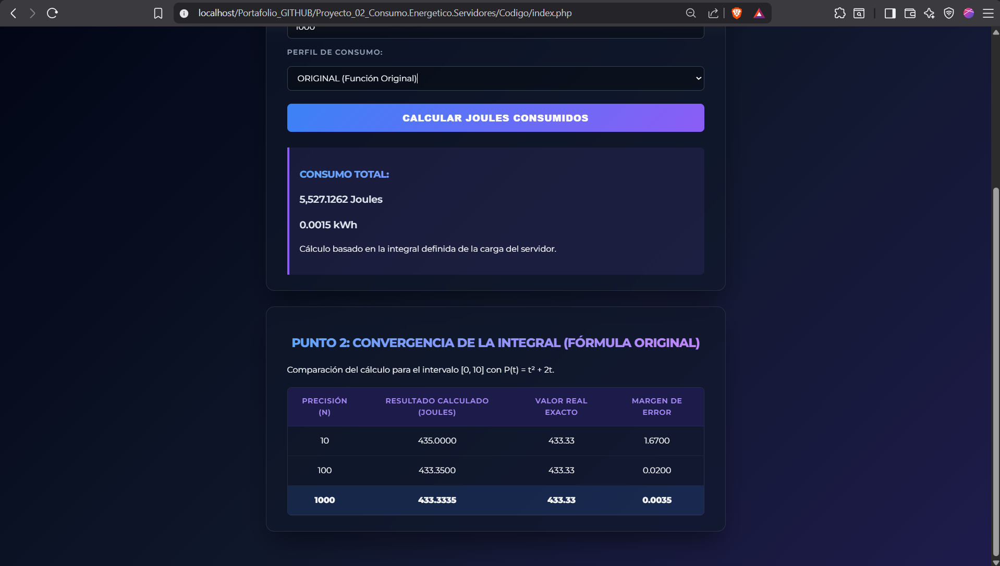

# Proyecto 02: Consumo energético de servidores

## 1. Nombre del proyecto
Actividad de evaluación C2 - Consumo energético servidores Unidad 3 - Métodos

## 2. Objetivo del proyecto
Desarrollar una herramienta web profesional basada en Programación Orientada a Objetos (POO) que implemente métodos de aproximación numérica (Regla del Trapecio) para calcular el consumo total de energía de un servidor en un Data Center, aplicando conceptos de modularización, encapsulamiento y control de excepciones en PHP 8.x.

## 3. Problema que resuelve
En los centros de datos (Data Centers), el consumo eléctrico de un servidor es dinámico y fluctúa según la carga de trabajo que experimenta la CPU en el tiempo. Para realizar una facturación precisa en servicios de la nube o cuantificar la huella de carbono, es necesario resolver la integral definida de la función de potencia eléctrica. Esta aplicación resuelve el problema mediante integrales numéricas automatizadas, permitiendo a los administradores de sistemas seleccionar perfiles de consumo específicos y obtener el gasto energético exacto transformado a Joules y Kilovatios-hora (kWh).

## 4. Tecnologías utilizadas
* **Lenguaje de programación backend:** PHP 8.x (estructurado con Namespaces y Tipado Estricto)
* **Diseño de interfaz de usuario:** HTML5, CSS3 personalizado (Estilo Dark Mode para Dashboard)
* **Estilos y Componentes:** Bootstrap 5.3 (Tablas responsivas y maquetación de tarjetas)
* **Entorno de servidor local:** XAMPP (Servidor Web Apache)

## 5. Conceptos aplicados
Siguiendo las directrices técnicas del modelo de evaluación, se incorporaron los siguientes fundamentos de POO e Informática:
* **Abstracción (Caja Negra):** La clase `IntegradorNumerico` actúa como una estructura independiente. La interfaz de usuario (`index.php`) desconoce la complejidad matemática de los algoritmos de integración; simplemente inicializa el objeto pasándole los parámetros y recibe el resultado final.
* **Encapsulamiento:** Las propiedades `$inicio`, `$fin` y `$pasos` están declaradas bajo visibilidad de acceso `private` para proteger el estado interno del objeto e impedir alteraciones arbitrarias desde fuera de la clase lógica.
* **Espacios de Nombres (Namespaces):** Implementación de `namespace App\Calculo` para estructurar profesionalmente el proyecto, aislar las clases lógicas de la interfaz global y evitar colisiones de nombres de funciones en sistemas de software complejos.
* **Gestión de Excepciones (Try-Catch):** Validación estricta de parámetros en el constructor de la clase para impedir errores lógicos severos de ejecución (por ejemplo, disparar un error controlado si el tiempo final es menor o igual al inicial o si los subintervalos son menores o iguales a cero).
* **Precisión vs. Rendimiento (Costo Computacional):** Análisis del bucle iterativo donde se evidencia que a mayor número de subintervalos ($n$) el margen de error disminuye drásticamente, pero el coste computacional y tiempo de procesamiento en el procesador aumentan de forma correlativa.

## 6. Capturas de pantalla

### Formulario de entrada y configuración
Panel de control de la interfaz web que permite parametrizar las variables de monitoreo del centro de datos, incluyendo la selección del perfil de consumo en un diseño adaptativo:

### Ejecución y resultados óptimos
Procesamiento numérico en tiempo real donde se calculan e imprimen simultáneamente los valores operativos en unidades físicas de Joules y su respectiva equivalencia en Kilovatios-hora (kWh):

### Validación y resultados de convergencia
Renderizado dinámico de la tabla comparativa que comprueba experimentalmente la Regla del Trapecio con los subintervalos fijados ($n=10$, $n=100$, $n=1000$), evidenciando cómo el margen de error decae hacia cero al aproximarse al valor teórico exacto (433.33):

## 7. Instrucciones de ejecución
1. Clonar o descargar la carpeta de este proyecto (`Proyecto_02_Consumo.Energetico.Servidores`) dentro del directorio del servidor local `C:\xampp\htdocs\`.
2. Iniciar los servicios del servidor web Apache desde el Panel de Control de XAMPP.
3. Abrir el navegador web de su preferencia de manera local.
4. Ingresar a la siguiente dirección en la barra de navegación: `http://localhost/Proyecto_02_Consumo.Energetico.Servidores/Codigo/index.php`.

## 8. Reflexión personal

### ¿Qué aprendí?
Se comprendió el valor real de los *Namespaces* para escribir código PHP estándar y reutilizable, y cómo mapear abstracciones matemáticas del mundo de la física a algoritmos lógicos usando el bucle `for`. Adicionalmente, asimilé la importancia práctica de la POO en entornos comerciales: estructurar el sistema de esta forma permite que si mañana los sensores del centro de datos registran variables en Amperios en vez de Watts, solo deba modificarse la clase interna sin alterar en lo absoluto la interfaz visual del usuario.

### ¿Qué fue difícil?
La principal dificultad residió en estructurar correctamente la lógica del cálculo numérico para que la iteración del Trapecio no generara errores de precisión por redondeo flotante, acoplándolo limpiamente con la inyección dinámica de las fórmulas matemáticas según el perfil de consumo seleccionado (`IDLE`, `AVERAGE` o `STRESS`) sin saturar el rendimiento del servidor local.

### ¿Qué mejoraría?
Para optimizar el software de cara a un ambiente empresarial como Amazon Web Services (AWS) o Google Cloud, reemplazaría las fórmulas embebidas por un patrón de diseño *Strategy* o funciones de callback, permitiendo que el administrador del Data Center pueda dar de alta nuevas curvas de consumo de CPU complejas en tiempo de ejecución sin necesidad de modificar el archivo de la clase lógica.
