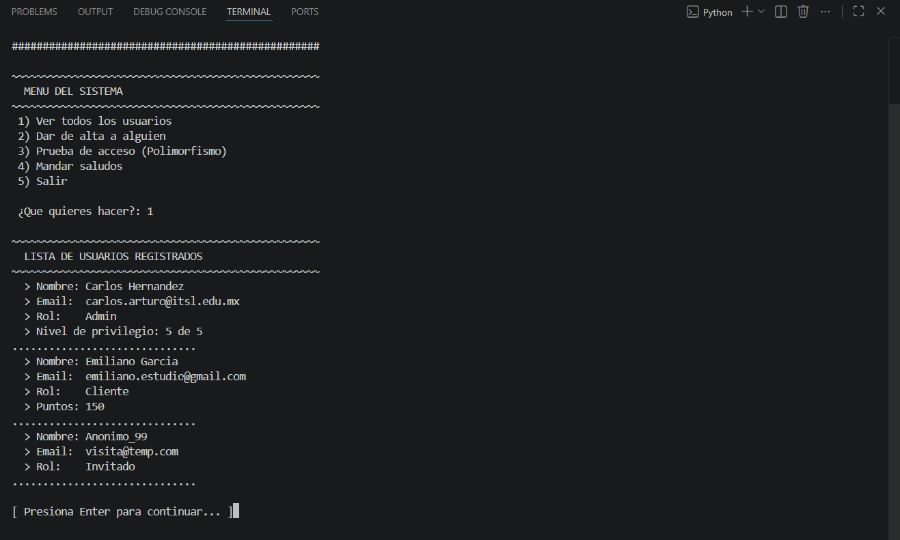
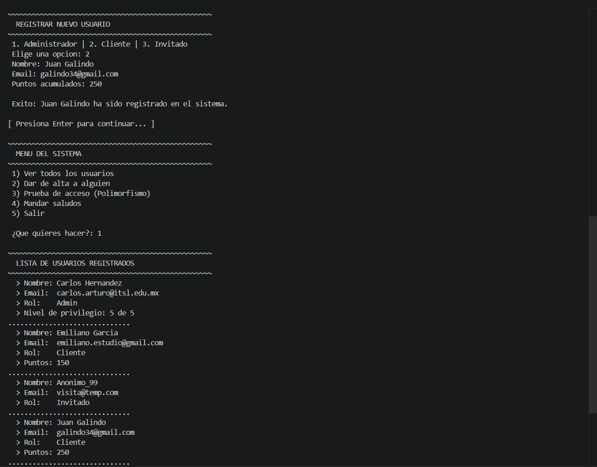
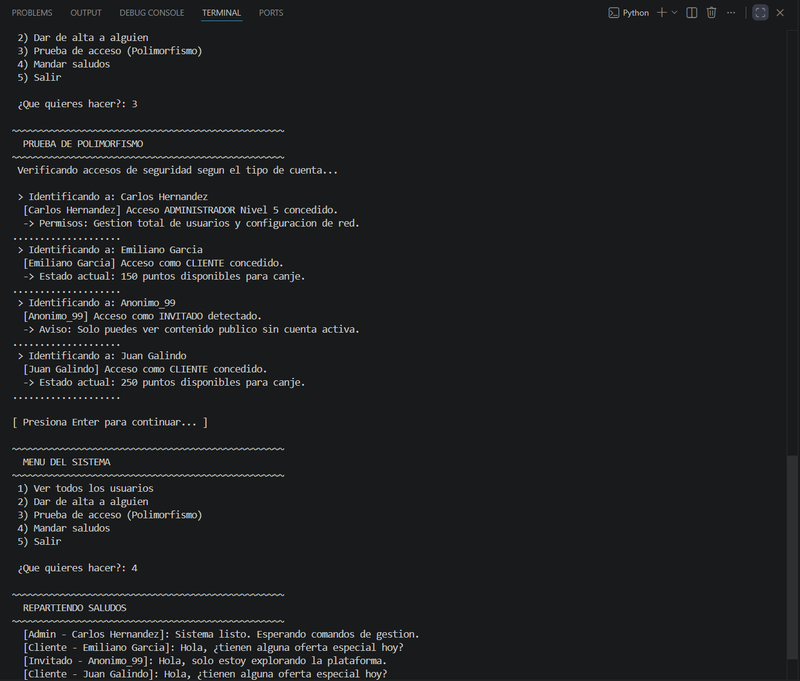

# Proyecto 03: Usuarios

## 1. Nombre del proyecto
Actividad de evaluación c3 - usuarios

## 2. Objetivo del proyecto
Desarrollar un sistema informático modular basado en Programación Orientada a Objetos utilizando el lenguaje Python, con la finalidad de implementar una arquitectura de software jerárquica mediante herencia y polimorfismo dinámico para la administración y validación de accesos de distintas entidades de usuario, garantizando la correcta inicialización de constructores base y la reutilización de código fuente.

## 3. Problema que resuelve
Las plataformas de software digital requieren controlar de forma asimétrica los permisos, flujos de operación y estados de múltiples perfiles de usuario. Diseñar módulos aislados o duplicar lógica para entidades similares genera una redundancia crítica y un acoplamiento difuso que degrada la mantenibilidad del sistema. Este software resuelve dicha problemática al centralizar los atributos de identidad transversales en una superclase abstracta y delegar las particularidades y reglas de negocio específicas (tales como niveles de privilegio o acumulación de puntos de fidelidad) en subclases especializadas que reaccionan de manera uniforme bajo una misma interfaz de ejecución.

## 4. Tecnologías utilizadas
* **Lenguaje de programación backend:** Python 3.x
* **Entorno de desarrollo integrado:** Visual Studio Code
* **Consola de ejecución:** Terminal integrada de VS Code

## 5. Conceptos aplicados
* **Herencia pura:** Derivación jerárquica de las clases hijas `Admin`, `Cliente` e `Invitado` a partir de la superclase `Usuario` para heredar propiedades y métodos base, eliminando la duplicación de código.
* **Inicialización con constructores e invocación a `super()`:** Empleo del método constructor `__init__` complementado con la función nativa `super()` dentro de las clases derivadas para delegar de forma cohesiva la inicialización de los atributos comunes antes de procesar los campos específicos.
* **Sobrescritura de métodos (Method Overriding):** Redefinición técnica de la función `acceso_sistema()` en cada una de las clases derivadas para suplantar la respuesta por defecto de la superclase y modelar de forma precisa los privilegios correspondientes a cada cuenta.
* **Polimorfismo dinámico:** Iteración sistemática sobre una colección lineal heterogénea (lista indexada) de objetos del tipo `Usuario` para invocar de forma uniforme los métodos `acceso_sistema()` y `saludar()`, delegando la resolución exacta de la rutina al motor de ejecución en tiempo de ejecución.
* **Modularización estricta:** Segmentación del código fuente en componentes independientes (`usuario.py`, `admin.py`, `cliente.py`, `invitado.py`, `main.py`) para optimizar la cohesión del diseño arquitectónico.
* **Análisis sintáctico y validación de datos:** Implementación de bloques de lógica condicional para realizar la validación sintáctica de cadenas de texto destinadas al atributo crítico de correo electrónico.

## 6. Capturas de pantalla

### Vista del menú principal y listado de instancias
Interfaz de línea de comandos (CLI) interactiva que gestiona el control de operaciones del sistema. Al procesar la opción 1, se recorre la lista en memoria para listar y detallar las propiedades heredadas y específicas de los usuarios registrados, mostrando el estado inicial del entorno informático.



### Flujo de registro dinámico de subclases
Captura detallada del asistente de consola diseñado para dar de alta a una nueva instancia en tiempo de ejecución. La vista documenta la selección del tipo de cuenta, el paso ordenado de parámetros requeridos por el constructor parametrizado y su posterior almacenamiento en el arreglo dinámico del sistema.



### Despacho polimórfico de métodos y resultados de ejecución
Demostración técnica del polimorfismo dinámico y la rutina de saludo global. Al interactuar con el menú principal, el motor de ejecución resuelve los métodos sobreescritos de manera asimétrica para cada elemento de la colección, arrojando mensajes diferenciados según los niveles de privilegio del objeto.



## 7. Instructions de ejecución
1. Coloque la totalidad de los archivos fuente del proyecto (`usuario.py`, `admin.py`, `cliente.py`, `invitado.py`, `main.py`) dentro de un mismo directorio local.
2. Inicie la terminal de comandos de su sistema operativo o abra la consola integrada de Visual Studio Code.
3. Diríjase a la ruta exacta donde se localizan los scripts e invoque el intérprete de comandos mediante la siguiente instrucción:
   ```bash
   python main.py
4. Utilice los dígitos numéricos del 1 al 5 en la interfaz interactiva para navegar por los ciclos de visualización de usuarios, inserción de nuevas subclases y comprobaciones de accesos polimórficos.

## 8. Reflexión personal
### ¿Qué aprendí?
Se consolidó de manera práctica la implementación de la herencia en Python, asimilando la sintaxis de paso de clases base como argumentos y la obligatoriedad del uso de `super()` para mantener la integridad de los constructores. Comprendí que el polimorfismo permite tratar colecciones de objetos bajo una interfaz común, facilitando la escalabilidad del sistema sin necesidad de condicionar el flujo de ejecución mediante validaciones manuales de tipo.

### ¿Qué fue difícil?
El mayor reto consistió en estructurar el paso de datos en el constructor de las subclases para acomodar de manera limpia tanto los atributos heredados de la superclase como aquellos que eran propios de los roles específicos (`nivel_acceso` y `puntos`), logrando que el método común de despliegue mostrara correctamente los datos sin corromper el encapsulamiento de los objetos.

### ¿Qué mejoraría?
Para robustecer el sistema frente a entornos reales de producción, integraría validaciones avanzadas mediante expresiones regulares para asegurar el formato estricto de las cadenas de correo electrónico ingresadas. Adicionalmente, implementaría el módulo `abc` de Python para definir la clase `Usuario` como una clase abstracta pura, garantizando contractualmente que cualquier nueva subclase que se añada a futuro deba implementar forzosamente el método `acceso_sistema()`.
