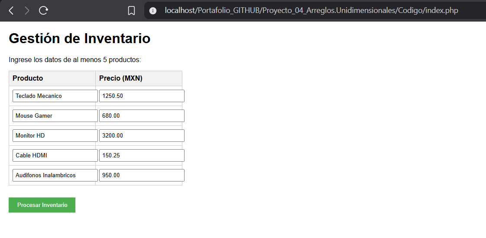
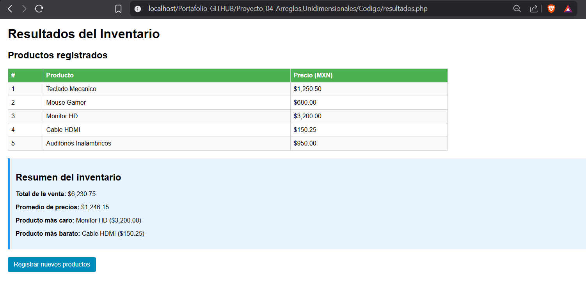

# Proyecto 04: Arreglos unidimensionales

## 1. Nombre del proyecto
Actividad Integradora – Arreglos unidimensionales 

## 2. Objetivo del proyecto
Desarrollar un módulo web interactivo en PHP que aplique el uso de arreglos unidimensionales paralelos para el almacenamiento, procesamiento y análisis estructurado de datos comerciales, integrando funciones nativas de manipulación de arreglos y maquetación responsiva en HTML5 para optimizar el rendimiento y la presentación de la información.

## 3. Problema que resuelve
Las plataformas de comercio electrónico requieren procesar colecciones de datos dinámicas en sus inventarios, tales como nombres de productos y estructuras de precios, para realizar cálculos operativos agregados de forma inmediata. Almacenar estas variables de forma aislada generaría un desbordamiento de variables independientes y un código difícil de mantener. Esta aplicación mitiga dicha problemática al indexar la información en arreglos paralelos vinculados por su índice posicional, automatizando los cálculos del gasto total, costo promedio, valores máximos y mínimos sin la necesidad de iteraciones manuales redundantes que sobrecarguen el servidor web backend.

## 4. Tecnologías utilizadas
* **Lenguaje de programación backend:** PHP 8.x
* **Diseño de interfaz de usuario:** HTML5, CSS3 personalizado
* **Estilos y componentes:** Bootstrap 5.3
* **Entorno de servidor local:** XAMPP (Apache)

## 5. Conceptos aplicados
* **Arreglos unidimensionales paralelos:** Uso coordinado de las estructuras `$productos[]` y `$precios[]`, donde la correspondencia de los datos de un mismo artículo se preserva de manera estricta a través del índice entero asignado por el motor de ejecución.
* **Funciones nativas de agregación:** Implementación de `array_sum()` para la acumulación lineal de los valores flotantes, y las rutinas de búsqueda optimizada `max()` y `min()` para la identificación de cotizaciones extremas con un costo computacional mínimo.
* **Separación de responsabilidades de arquitectura:** Segmentación de operaciones mediante archivos especializados: captura de datos en el cliente (`index.php`), procesamiento lógico en el backend (`procesar.php`) y renderizado de la persistencia temporal en pantalla (`resultados.php`).
* **Validación de integridad en el cliente:** Inyección de directivas nativas de HTML5 en los campos de entrada del formulario para restringir tipos de datos y evitar el envío de peticiones HTTP con colecciones asimétricas o valores nulos.

## 6. Capturas de pantalla

### Vista del formulario de captura de inventario
Interfaz que presenta los campos de entrada para el registro de productos y precios, utilizando un diseño responsivo que facilita la carga de datos del inventario inicial antes de su procesamiento.

### Procesamiento y despliegue de resultados
Visualización de la respuesta generada por el servidor tras enviar los datos, donde se presenta una tabla organizada con el desglose de productos y los indicadores estadísticos calculados mediante funciones de agregación.

## 7. Instructions de ejecución
1. Coloque la carpeta del proyecto (`Proyecto_04_Arreglos.Unidimensionales`) dentro del directorio local del servidor web Apache en `C:\xampp\htdocs\`.
2. Inicie los servicios del servidor local desde el Panel de Control de XAMPP.
3. Abra un navegador web e introduzca la siguiente URL en la barra de direcciones: `http://localhost/Proyecto_04_Arreglos.Unidimensionales/Codigo/index.php`.
4. Digite los datos correspondientes a los 5 artículos en el formulario y procese el envío para evaluar la tabla de analíticas resultantes.

## 8. Reflexión personal

### ¿Qué aprendí?
Se comprendió la utilidad práctica de los arreglos unidimensionales paralelos para agrupar y procesar colecciones de datos homogéneas vinculadas por su posición indexada. Asimismo, asimilé el valor de utilizar las funciones nativas de PHP como `array_sum()`, `max()` y `min()`, las cuales optimizan el rendimiento del servidor al delegar las operaciones de búsqueda y cálculo a subrutinas optimizadas de bajo nivel, en lugar de emplear ciclos iterativos manuales escritos en el espacio del usuario.

### ¿Qué fue difícil?
La principal dificultad técnica consistió en asegurar la simetría absoluta entre los arreglos paralelos durante la transferencia de datos mediante el método POST, garantizando que el índice posicional de un producto correspondiera exactamente con su respectivo precio en el backend sin provocar desfases lógicos en caso de que un campo contuviera datos nulos o corrompidos.

### ¿Qué mejoraría?
Para escalar este sistema hacia un entorno de grado empresarial, reemplazaría la arquitectura de arreglos paralelos por un arreglo multidimensional asociativo o una colección de objetos de una clase `Producto`. Esto permitiría encapsular el nombre y el precio en una sola entidad estructurada, eliminando el riesgo de asimetría en los índices y facilitando la persistencia de datos mediante una base de datos relacional.
