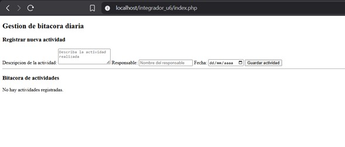
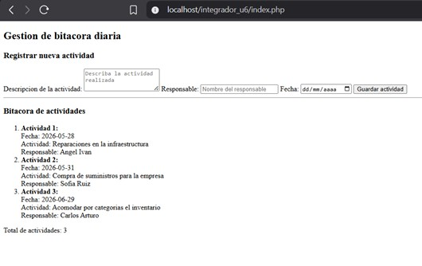
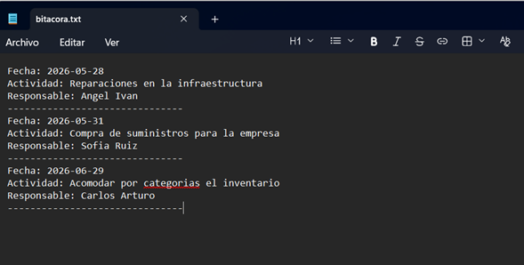

# Proyecto 05: Gestión de Bitácoras en Archivos de Texto

## 1. Nombre del proyecto
Actividad Integradora – Gestión de Bitácoras en Archivos de Texto

## 2. Objetivo del proyecto
Desarrollar un módulo web en PHP que permita la gestión completa de una bitácora diaria mediante el almacenamiento persistente en archivos de texto plano, implementando operaciones de escritura en modo append, lectura secuencial del archivo y validación de datos de entrada, con el fin de simular un sistema digital ligero de registro de actividades para una empresa de seguridad.

## 3. Problema que resuelve
Una empresa de seguridad lleva actualmente un registro manual en papel de las actividades diarias de su equipo (revisiones, incidentes, tareas completadas y pendientes). El director desea migrar a un formato digital ligero sin recurrir a bases de datos por razones de infraestructura y simplicidad operativa. Este sistema resuelve la problemática al proporcionar una solución basada únicamente en archivos de texto plano, permitiendo registrar nuevas actividades, conservar el historial completo mediante escritura sin sobrescritura, consultar todas las actividades registradas en orden cronológico de ingreso y validar que no se almacenen campos vacíos, todo ello sin necesidad de configurar un sistema gestor de bases de datos.

## 4. Tecnologías utilizadas
- **Lenguaje de programación backend:** PHP 8.x
- **Diseño de interfaz de usuario:** HTML5
- **Estilos y componentes:** CSS3 personalizado
- **Entorno de servidor local:** XAMPP (Apache)
- **Almacenamiento persistente:** Archivos de texto plano (`.txt`)

## 5. Conceptos aplicados
- **Manejo de archivos en modo append:** Uso de `file_put_contents()` con la bandera `FILE_APPEND` y `LOCK_EX` para escritura segura al final del archivo sin sobrescribir el contenido existente, garantizando la integridad del historial de actividades.
- **Lectura completa de archivos:** Implementación de `file_get_contents()` para recuperar todo el contenido del archivo `bitacora.txt` y posterior procesamiento para su visualización estructurada.
- **Validación de datos del lado del servidor:** Verificación de campos vacíos (`empty()`) antes de la escritura, con retroalimentación al usuario mediante mensajes de error o éxito embebidos en la interfaz.
- **Estructura de archivos plana:** Organización del proyecto en una carpeta contenedora con el script principal `index.php` y el archivo de datos `bitacora.txt` que se genera automáticamente en la primera ejecución.
- **Formato estructurado de registro:** Cada entrada se almacena con un delimitador visual (`---`) que permite diferenciar actividades durante la lectura y el parseo posterior.

## 6. Capturas de pantalla

### Vista del formulario de registro de actividades
Interfaz principal que presenta el formulario para capturar la descripción de la actividad, el responsable y la fecha programada, así como el área de visualización de la bitácora existente.

### Procesamiento y despliegue de resultados
Visualización de la bitácora después de registrar múltiples actividades, mostrando una lista ordenada numerada con los detalles de cada entrada y el conteo total de actividades almacenadas.

### Contenido del archivo de texto generado
Captura del archivo `bitacora.txt` con el formato de almacenamiento plano, donde se aprecia la estructura de cada registro con fecha, actividad, responsable y el separador entre actividades.

## 7. Instrucciones de ejecución
1. Coloque la carpeta del proyecto (`Proyecto_05_Gestion_Bitacoras`) dentro del directorio local del servidor web Apache en `C:\xampp\htdocs\`.
2. Inicie los servicios de Apache desde el Panel de Control de XAMPP.
3. Abra un navegador web e introduzca la siguiente URL en la barra de direcciones: `http://localhost/Proyecto_05_Gestion.Bitacoras/Codigo/index.php`.
4. Complete el formulario con la descripción de la actividad, el responsable y la fecha, luego presione el botón "Guardar actividad".
5. Visualice inmediatamente la actividad registrada en la lista ordenada de la bitácora.
6. Para agregar más actividades, repita el proceso; todas se conservarán sin borrar las anteriores.

## 8. Reflexión personal

### ¿Qué aprendí?
Comprendí la utilidad práctica del manejo de archivos de texto en PHP como mecanismo de persistencia ligero cuando no se requiere un sistema de base de datos formal. Aprendí la diferencia crítica entre escribir en un archivo con `file_put_contents()` de forma normal (que sobrescribe) frente al uso de la bandera `FILE_APPEND` (que agrega al final sin destruir datos previos). También asimilé la importancia de validar entradas antes de la escritura para evitar registros vacíos o corruptos en el archivo de bitácora.

### ¿Qué fue difícil?
La principal dificultad técnica fue gestionar correctamente la lectura y el formateo del archivo para mostrar las actividades en una lista ordenada `<ol>`, ya que el archivo almacena los datos con saltos de línea y delimitadores que requieren ser interpretados adecuadamente para extraer cada campo individual (fecha, actividad, responsable) y presentarlos con una estructura visual clara.

### ¿Qué mejoraría?
Para extender este sistema hacia una solución más robusta, implementaría un sistema de autenticación simple para que cada responsable solo pueda ver o editar sus propias actividades. También añadiría funcionalidades de búsqueda por rango de fechas, edición de registros existentes (modificar una entrada ya guardada) y eliminación de actividades, lo cual requeriría implementar un formato más estructurado como CSV o JSON dentro del archivo plano para facilitar la localización y modificación de registros específicos.
